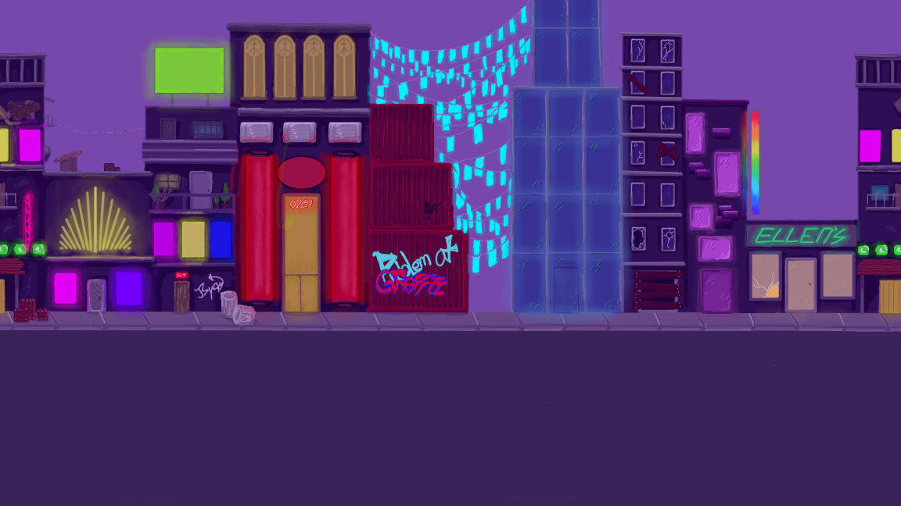
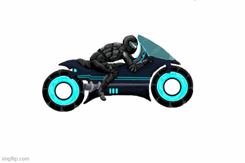
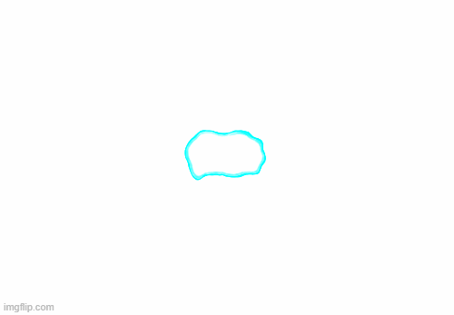
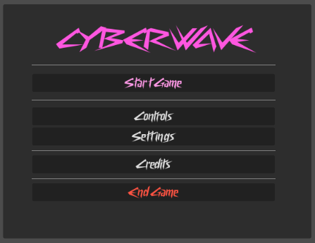
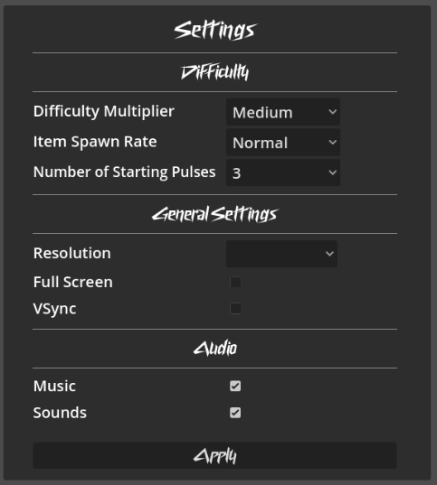
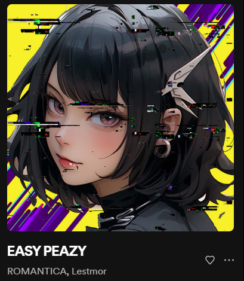

# Game Creation with Godot
# "CYBERWAVE"
## About
This game was developed during the 3.5 week summer course program
"Game Creation with Godot 2023" of the Montana State University
and the Freie Universität Berlin.

The goal was to create a simple 2D game with Godot Engine in teams of two persons from both universities.

Our game with the name "CYBERWAVE" is a sidescrolling racing game. The player controls a motorcyclist and has to evade incoming obstacles in form of cars.

In the current form the game is implemented as a arcade style game with no fixed ending. It progressively gets faster and therefore more difficult until the player fails to evade the obstacles.

## Highlights

We want to show a few parts of the game we like the most or are the most proud of.

1. Background
    - Game Art is one of the biggest time killers in the Development process. Therefore we are very proud of our moving and looping background and the level of detail.

    
2. Animations
    - While the sequences of the animations could be improved a little further we are really content on how they turned out in general.
    - We did not make animations like these before and drew them frame by frame.

    

    

    

3. Game Menu
    - The menu of the game consists of several different panels and enables the player to configure some aspectes of the gameplay as well as some technical details.
    - We consider making adjustments to a game and being able to configure settings to be an important part of a game. Therefore we wanted to make these things possible.
    - We also wanted to give players the opportunity to look at the controls of the game to not be confused or overwhelmed by it.

    

    

## Weaknesses
Some parts of the game need to be improved but due to lack of time they remain in the current status for now.

1. Lagging background
    - At higher speed the looping background starts to lag. The cause of this problem is not clear.
2. Cryptic debugging errors
    - When items are spawned/instantiated an error gets thrown by the debugging environment whose cause is also unclear.
    - The obstacles which are spawned and implemented in a very similar way do not cause any problems.
    - Error Message: *_on_item_timer_timeout(): Condition "!is_inside_tree()" is true. Returning: false*
3. Architecture & Efficiency
    - Due to the time constraints of the project the main focus of the game was "it should work". Therefore several parts of the code are not implemented in the most elegant way and could be refactored into more efficient solutions.
    - Some code is for example redundant and could be extracted into parent classes and some functions are implemented in various scripts being implemented just once and getting used in these scripts.
## Future Enhancements

We have a few ideas how the game could be improved in the future.

1. Designing a specific goal for the game
    - Currently the gameplay is endless whith no specific end.
    - Different levels could be implemented with varying degrees of difficulty, different backgrounds and obstacles.
    - A "bossfight" can be implemented. One way for this would be an enemy that throws a specific kind of obstacle and the player needs to fire a few pulses to defeat the enemy.
2. Making the gameplay more diversified
    - More than one kind of obstacles or a changing background could make the game more interesting.
3. Refactoring the project
    - Several parts of the code can be considered as quick and dirty solutions for problems. With some effort and enough time, the project can be optimized to have a more sophisticated and clean architecture.
    - Another goal for refactoring could be an optimization for computer resources like cpu or other memory usage.

## Contributions to the Project

Almost all work of the project was done by Rebekah Yager and Luis Günther.

Only the song which is currently used as a background music was not made by us (EASY PEAZY - ROMANTICA, Lestmor).

### Contributions by Rebekah Yager
#### Design
- Background Art
- Player Art
- Player Animation Frames
- Obstacles Art
#### Development
- Background Functionality
- Player Movement
- Player Animation Logic
- Integration of Music

### Contributions by Luis Günther
#### Design
- Item Art
- Item Animation Frames
- Explosion Effect
#### Development
- Item Logic
- Item Animation Logic
- Item Sounds
- HUD
- Obstacle Movement and Collision
